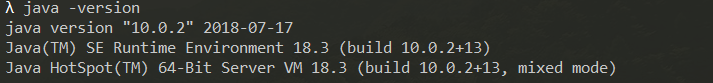

# 文件管理系统模拟


开发语言为java，界面基于javafx构建

如果打开可执行文件报错，可能是版本问题，本项目开发过程中使用jdk和jre版本:



## 项目背景

文件系统是操作系统中统一管理信息资源的一种软件，管理文件的存储、检索、更新，提供安全可靠的共享和保护手段，并且方便用户使用。对于操作系统而言，文件系统是必不可少，本次项目要求实现一个模拟的文件系统。在内存中开辟一个空间作为文件存储器，在其上实现一个简单的文件系统。退出这个文件系统时，需要该文件系统的内容保存到磁盘上，以便下次可以将其恢复到内存中来。

#### 文件系统提供的操作：

- 格式化
- 创建子目录
- 删除子目录
- 显示目录
- 更改当前目录
- 创建文件
- 打开文件
- 关闭文件
- 写文件
- 读文件
- 删除文件

## 设计

### 数据结构

FCB存储文件的ID，名字，大小，类型，创建时间修改时间，物理地址，父节点和子节点等

```java
public class FCB implements Serializable {    
	private int fileID;
    public String name;
    private String size;
    public enum Type {
        folder,     //目录文件
        document    //数据文件
    }
    private Type type;
    private String createTime;
    private String modifyTime;
    private SimpleDateFormat simpleDateFormat = new SimpleDateFormat("yyyy-MM-dd HH:mm:ss");
    //索引表，指向物理地址
    private int [] indexTable = new int [2000];
    private FCB parent;
    private ArrayList<FCB> child = new ArrayList<FCB>();
    public enum Authority {
        readonly, //只读
        writable  //可写
    }
    private Authority authority;
    ...
}
```

Disk为模拟物理磁盘的类，采用栈进行空闲空间管理。

```java
public class Disk implements Serializable {
    //每个磁盘块大小
    private int diskSize = 512;
    //磁盘块数量
    public  int diskBlockCount = 2000;
    //全部存储
    private  ArrayList<String> blockList = new ArrayList<>();
    //空块栈
    private  Stack<Integer> freeDiskBlock = new Stack<>();
    ...
}
```

从Disk我们可以看出，目前暂定支持最大为1000K的文件的存储。

DirectoryTree为目录树，存储着所有FCB的信息以及它们的关系，根节点为root。

```java
public class DirectoryTree implements Serializable {
    private  FCB root = new FCB("root", FCB.Type.folder, null);
    public  ArrayList<FCB> directoryTree = new ArrayList<FCB>();
    DirectoryTree() {
        directoryTree.add(root);
        ...
    }
    ...
}
```

Disk和Directory为记录文件信息的主要类，Controller里有它们的静态(static)实例。

同时可以注意到它们都实现了`Serializable`接口，这是因为在main函数里边会在程序退出时通过ObjectOutputStream的writeObject函数将这两个实例的信息写入data.txt和disk.txt文件中。

```java
        primaryStage.setOnCloseRequest(event -> {
            saveObjToFile(Controller.directoryTree);
            saveDiskToFile(Controller.disk);
        });
```

而Controller里的initialize初始化函数会在重新打开程序时在getObjFromFile和getDiskFromFile中调用ObjectOutputStream的readObject函数以重新将信息加载到disk和directoryTree，以此来实现文件系统内容的保存与恢复。

## 算法设计

### 新建


主界面如图，此界面的fxml文件为sample.fxml,控制器为Controller

新建文件的回调函数如下

```java
        makeFile.setOnAction(e-> {
            directoryTree.addFile(currentDirectory,"new file " + newFileNumber++);
            updateFileList();
        });
```

其调用了directoryTree的addFile方法

```java
   //新建文件
    public void addFile(FCB parent, String name) {
        //当前目录有重名的
        if(!isSameName(parent,name)) {
            FCB fcb = new FCB(name, FCB.Type.document, parent);
            directoryTree.add(fcb);
        }
    }
```

在FCB的构造函数里，会将这个新建的FCB添加到其父节点的child里边。新建子目录的实现类似，不再赘述。

### 打开

列表里每一个文件都有对应的打开，删除，和详情。对应的回调函数在ListItem文件里实现

如果是文件夹点击打开会调用updateCurrentPath()和updateFileList()刷新列表和当前路径。

```java
                    Controller.currentDirectory = fcb;
                    Controller.updateCurrentPath();
                    Controller.updateFileList();
```


如果是文件点击打开，则会加载新的场景，此场景的fxml文件为file.fxml，控制器为FIleController。（也会将对应文件的fcb加入文件打开表中）

```java
Parent root = FXMLLoader.load(getClass().getResource("file.fxml"));
Stage stage = new Stage();
Main.stages.put(fcb, stage);
stage.setTitle("File");
stage.setScene(new Scene(root, 800, 500));
stage.show();
```


点击保存会调用diskManager的write函数，将文件内容写入disk里。fcb里的indexTable会存储记录文件信息的相应disk的blockLisk里的索引。

如图为一个81K的文件的fcb的indexTable示意（指向存储文件的模拟的物理地址）：


...中间过长无法全部展示，结尾如图：


如图。共用了164个块。每个块大小为512，计算得与文件大小相符。

此时的Disk文件可以看到空闲块剩下1836块，等于2000-164


Disk中的实际模拟磁盘的存储变量blockLisk的状态如图，indexTable存储的即是对应信息在blockLisk的索引：


在这个页面可以对文件重命名，但是如果同级目录下有同名文件就无法命名，比如以下为新建一个名字为”第一个文件“的文件：


### 删除

```java
        delete.setOnAction(event -> {
            if(fcb.getType() == FCB.Type.document) {
                Controller.directoryTree.deleteFile(fcb);
                Controller.diskManager.delete(fcb);
                Controller.updateFileList();

            } else {
                Controller.directoryTree.deleteFolder(fcb);
                Controller.diskManager.delete(fcb);
                Controller.updateFileList();
            }
        });
```

删除的回调函数如上，会在directoryTree和disk里同时将文件信息删除，如果是文件夹的会递归删除里边的所有文件。

### 详情

点击详情，会在左下角显示文件的一些详细信息


由于UI的控制是在Controller类里，而列表的每一项是在ListItem类里，UI的Label组件无法声明为static，所以在其他类里不能直接通过Controller.label获得UI对象。故只能通过在Controller里声明static的stringproperty变量，这些变量通过addListener绑定UI对象实现监听机制，这样在其他类里就可以通过更新stringProperty类型的变量更新UI组件。这里介绍主要是因为这是本项目里多处使用到的UI通信机制。

Listitem类里：

```java
        detail.setOnAction(event -> {
            Controller.updateDetail(fcb.displayDetails(fcb));
        });
```

Controller类里：

```java
    public static void updateDetail(String value) {
        detailText.setValue(value);
    }
```


### 返回上一级

返回上一级与文件夹的打开实现方式类似，都是更新currentDirectory后调用              updateCurrentPath()和updateFileList()函数。不过会先判断当前路径是否为根路径。

```java
        back.setOnAction(e-> {
            if(!currentDirectory.getName().equals("root")) {
                currentDirectory = currentDirectory.getParent();
                updateCurrentPath();
                updateFileList();
                currentFCB = currentFCB.getParent();
            }
        });
```


### 格式化

```java
        format.setOnAction(e-> {
            //此时不用用for循环，索引会变化会出问题
            while(directoryTree.getRoot().getChild().size() != 0) {
                FCB fcb = directoryTree.getRoot().getChild().get(0);
                if(fcb.getType() == FCB.Type.document) {
                    Controller.directoryTree.deleteFile(fcb);
                    Controller.diskManager.delete(fcb);
                    Controller.updateFileList();
                } else {
                    Controller.directoryTree.deleteFolder(fcb);
                    Controller.diskManager.delete(fcb);
                    Controller.updateFileList();
                }
            }
        });

```

格式化就是循环删除根目录下所有的文件，如果是文件夹会递归删除。